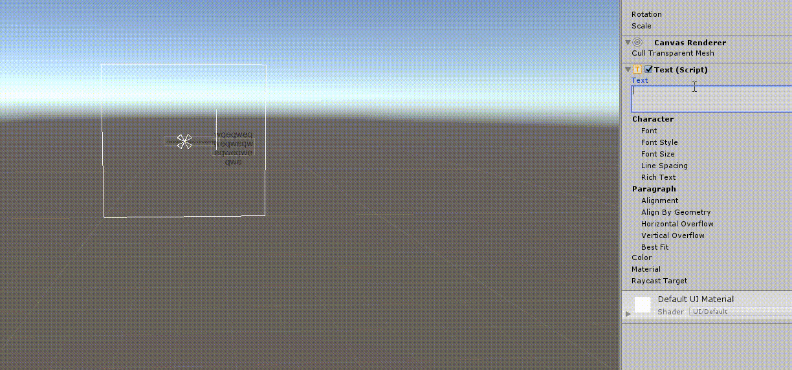
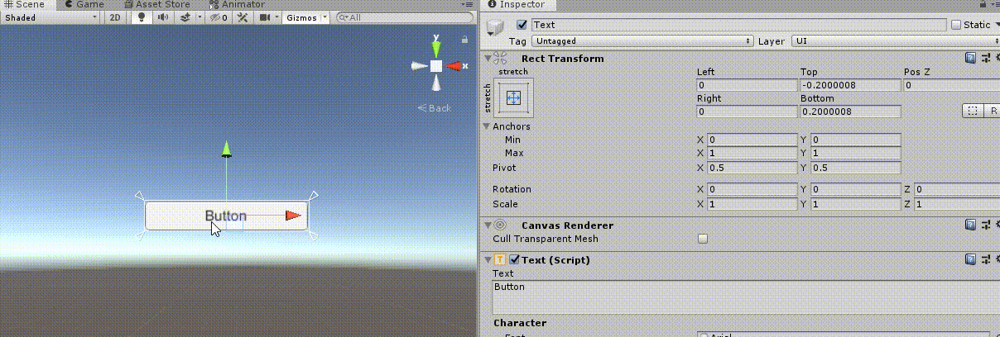
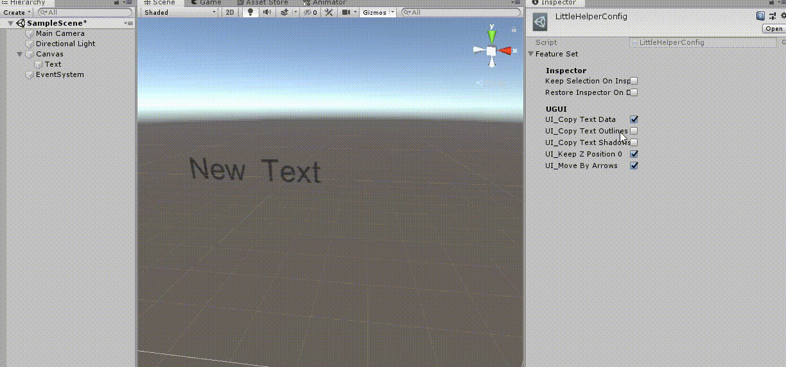
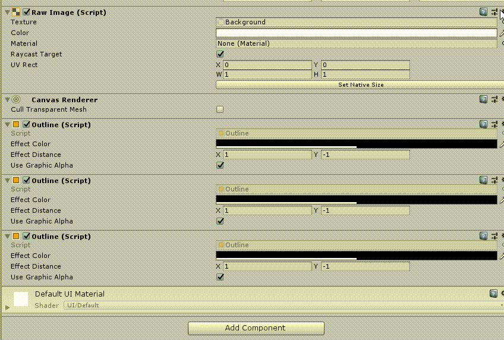
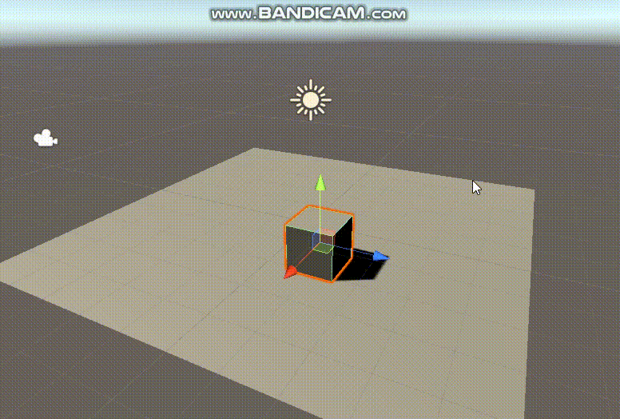

LittleHelper
====

This extension helps out people who suffer from Unity's poor UX. 
It mostly does not add particular features, it just make Unity editor to act more naturally.

UI
----
### AutoSize for Text

### Unit(1px) movement with Keyboard

### Keep inspector on empty selection

Editor
----
### Move to Top, Move to Bottom

### Stick to Ground
