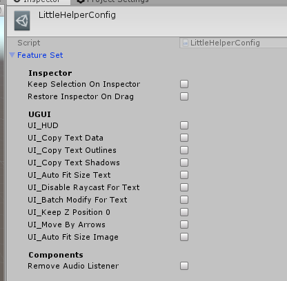
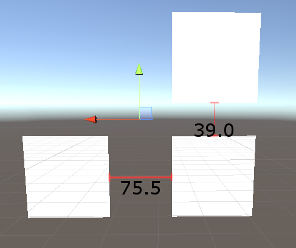
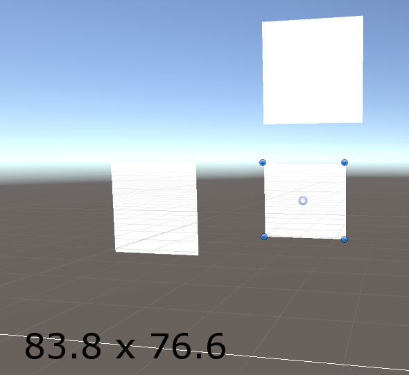
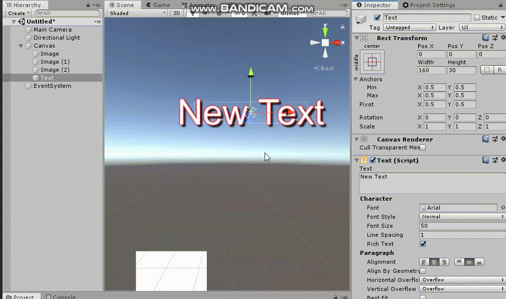
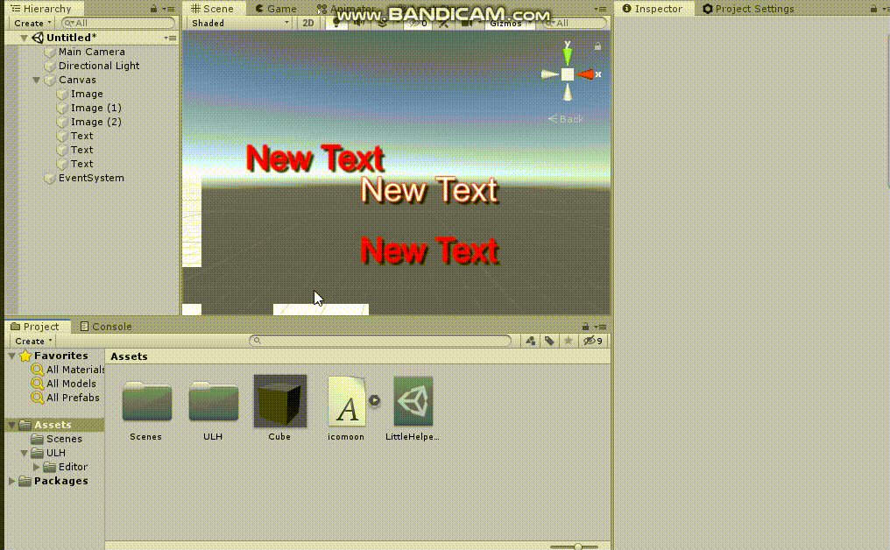

LittleHelper
====

This extension helps out people who suffer from Unity's poor UX. 
It mostly does not add particular features, it just make Unity editor to act more naturally.

Config
----

You can turn on/off each features in config window.

UI
----
### Distance Ruler

You can measure ditance between 2~ objects by selecting them. This is pretty useful when you 're working with organized UI guides (such as zepplin).

### Object Size

Unity does not show up object's size in fill mode(RectTransform). So I made it.

### Remember last property for Text

Nobody wants to use `Arial` and ugly gray color as a default text property.

### AutoSize for Text

### Unit(1px) movement with Keyboard

A tiny joy for UI designers(devs).

### Keep inspector on empty selection

Editor
----
### Restore inspector on Drag
Most desired feature for me, and also the reason why I made this project.  
When you clicked the asset to drag, inspector window will be changed to the asset's config. This made me crazy all the time.

### Move to Top, Move to Bottom

### Stick to Ground

Press `SpaceBar` to place an floating object on nearest ground.
